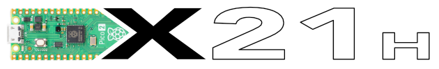

# picoX21H

A software/hardware hybrid simulation of the Yamaha DX21 using a Raspberry Pi Pio, a YM2151 (OPM) chip and an I2S DAC.

## Status

Done...
   + Interface to drive the YM2151 from the Pico
   + PIO based interface to recieve and translate the serial DAC data generated by the YM2151 (intended for a YM3012) including a sgtraight thru translatyion of the sampel data to an external I2S DAC
   + USB MIDI

## How to build

### Checkout

This repo uses git sub-modules, so checkout using --recurse to clone all the
dependent source...

    git clone --recurse https://github.com/AnotherJohnH/picoX21H.git

or

    git clone --recurse ssh://git@github.com/AnotherJohnH/picoX21H.git

### Software dependencies

+ https://github.com/AnotherJohnH/Platform
+ arm-none-eabi-gcc
+ cmake via UNIX make or auto detection of ninja if installed
+ Python3

### Build

Being developed on MacOS but should build on Linux too.

Indirect build of all supported targets, rpipico and rpipico2 with cmake and make (or ninja)...

    make

Build a single hardware target e.g. rpipico2 using cmake...

    mkdir build
    cd build
    cmake -DCMAKE_BUILD_TYPE=Release -DPLT_TARGET=rpipico2 -DCMAKE_TOOLCHAIN_FILE=Platform/MTL/rpipico2/toolchain.cmake ..
    make

flashable images will be found under the build sub-directory here...

    build/Source/picoX21H_PIMORONI_PICO_AUDIO.uf2

## License

This project is licensed under the MIT License - see the [LICENSE](LICENSE) file for details

## Acknowledgements

 + The engineers at [Yamaha](https://www.yamaha.com/en/about/design/synapses/id_009)
