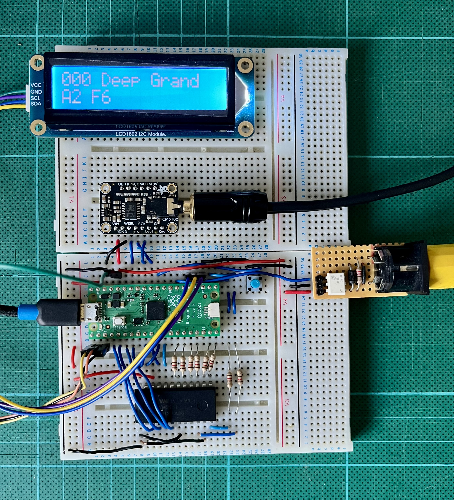

# picoX21H

A hybrid software/hardware simulation of the Yamaha DX21, using a Raspberry Pi Pico, a YM2151 (OPM) sound chip and an I2S DAC.

[Block Diagram](docs/block_diagram.pdf)

## Status

It's a working musical instrument! Any of the 128 preset patches from the DX21 ROM (v1.5)
can be selected and played via MIDI. Patches starting to sound like the real DX21.

Working...
   + USB MIDI interface (in "peripheral" mode)
   + Physical MIDI interface
   + Basic integration of MIDI ins with the software synth framework
   + YM2151 (OPM) driver
   + PIO-based YM3012 (DAC) interface
   + Captured YM3012 format samples translated to I2S (currently driving a Pimoroni Pico Audio module)
   + 16x2 LCD display

To do...
   + Verify that the YM2151 can accurately replicate the sound of the YM2164, the similar but different chip used in the DX21
   + Complete the implementation of YM2151 register control from all patch parameters
   + Implement a chorus, and maybe even reverb on the Pico's second core as the audio passes through to the I2S DAC

## Hardware

[Schematic](docs/schematic.pdf) for the above.

## Software

### Checkout

This repo uses git sub-modules, so checkout using --recurse to clone all the
dependent source...

    git clone --recurse https://github.com/AnotherJohnH/picoX21H.git

ore

    git clone --recurse ssh://git@github.com/AnotherJohnH/picoX21H.git

### Software dependencies

+ https://github.com/AnotherJohnH/Platform
+ arm-none-eabi-gcc
+ cmake via UNIX make or auto detection of ninja if installed
+ Python3

### Build

Being developed on MacOS but should build on Linux too.

Indirect build of all supported targets, rpipico and rpipico2 with cmake and make (or ninja)...

    make

Build a single hardware target e.g. rpipico2 using cmake...

    mkdir build
    cd build
    cmake -DCMAKE_BUILD_TYPE=Release -DPLT_TARGET=rpipico2 -DCMAKE_TOOLCHAIN_FILE=Platform/MTL/rpipico2/toolchain.cmake ..
    make

flashable images will be found under the build sub-directory here...

    build/Source/picoX21H_I2S_DAC.uf2

## License

This project is licensed under the MIT License - see the [LICENSE](LICENSE) file for details

## Acknowledgements

 + The engineers at [Yamaha](https://www.yamaha.com/en/about/design/synapses/id_009)
